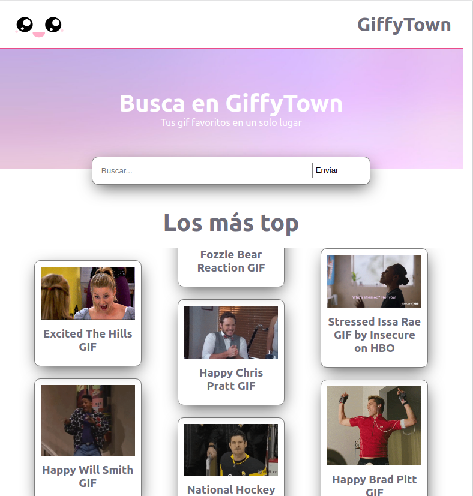
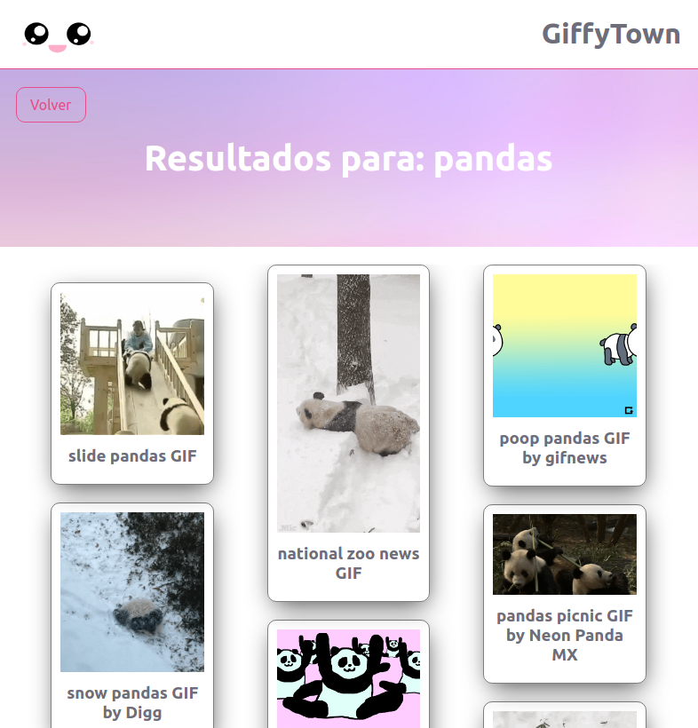
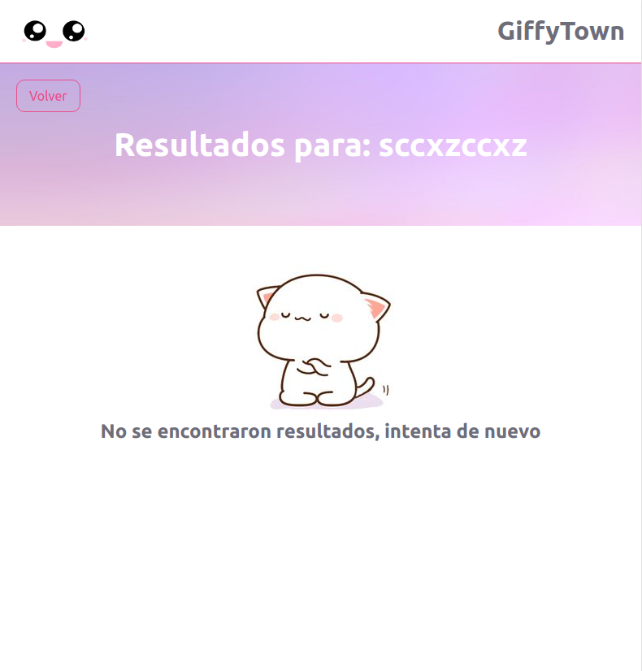

# GiffyTown

Buscador de gif.

Este proyecto fue creado [Create React App](https://github.com/facebook/create-react-app), utilizando la Api [Giphy](https://developers.giphy.com/)

### Demo del proyecto

[Demo del proyecto](https://oriananohemi.github.io/giffyTown/)

### Scripts

### Para ejecutar el proyecto
Puedes usar yarn start o npm run start

Se abrira una pestaña en el browser http://localhost:3000